<div align="center">

# 🎯 Quizi

### Aplikacja internetowa do przeprowadzania quizów

[](https://dotnet.microsoft.com/)
[](https://github.com/lukasz-porebski/Quizi.Web)
[](https://www.postgresql.org/)

### 🌐 [Zobacz aplikację](https://quizi-web-228453964568.us-central1.run.app)

</div>

---

Quizi to samodzielnie rozwijany projekt portfolio, będący trzecią iteracją aplikacji do przeprowadzania quizów. Celem projektu było m.in. praktyczne zastosowanie możliwości najnowszego .NET, wzorców DDD i CQRS, wdrożenie aplikacji w chmurze oraz budowa kompletnego pipeline'u CI/CD. Projekt jest rozwijany od stycznia 2025.

---

## 📑 Spis treści

- [🏗️ Architektura i wzorce](#️-architektura-i-wzorce)
- [⚙️ Technologie](#️-technologie)
- [☁️ Deployment](#️-deployment)
- [✨ Dostępne funkcje](#-dostępne-funkcje)
- [🔗 Powiązane repozytoria](#-powiązane-repozytoria)
- [🛠️ Narzędzia](#️-narzędzia)
- [🚀 Planowane funkcje](#-planowane-funkcje)

---

## 🏗️ Architektura i wzorce

Aplikacja jest **modularnym monolitem** zbudowanym w oparciu o sprawdzone wzorce projektowe:

- 🧅 **Onion Architecture** - separacja warstw i zależności
- 🎨 **Domain-Driven Design (DDD)** - modelowanie domeny biznesowej
- 🔀 **Command Query Responsibility Segregation (CQRS)** - rozdzielenie operacji odczytu i zapisu



---

## ⚙️ Technologie

### Backend & Framework
- 🟣 **.NET 10** - środowisko uruchomieniowe
- 📨 **MediatR** - implementacja CQRS
- 💾 **Entity Framework Core** - ORM (przetwarzanie komend)
- ⚡ **Dapper** - odczyt danych z bazy (przetwarzanie zapytań)

### Bezpieczeństwo
🔐 **JWT** - uwierzytelnianie i autoryzacja

### Testy
- ✅ **xUnit** - framework do testów jednostkowych
- 🔍 **Fluent Assertions** - asercje
- 🎭 **Moq** - mocki
- 🎲 **AutoFixture** - dane testowe

### Biblioteki & Infrastruktura
- 📝 **Serilog** - strukturyzowane logowanie
- 🗺️ **AutoMapper** - mapowanie obiektów
- 📚 **Swagger** - dokumentacja API
- 🏗️ **Autofac** - kontener dependency injection

---

## ☁️ Deployment

Aplikacja jest wdrożona na **Google Cloud Platform** z wykorzystaniem w pełni zautomatyzowanego pipeline'u CI/CD:

| Usługa | Rola |
|--------|------|
| 🔧 **Cloud Build** | Pipeline CI/CD |
| 🏃 **Cloud Run** | Hosting aplikacji |

### Pipeline CI/CD

```
Restore NuGet → Testy jednostkowe → Publish → Build obrazu Docker → Push → Deploy na Cloud Run
```

---

## ✨ Dostępne funkcje

- ✅ Lista quizów
- ➕ Dodawanie quizu
- ✏️ Edytowanie quizu
- 🗑️ Usuwanie quizu
- ▶️ Uruchamianie quizu
- 📊 Historia wyników quizów
- 👥 Lista użytkowników
- 👁️ Podgląd quizu

---

## 🔗 Powiązane repozytoria

| Repozytorium | Opis |
|---|---|
| 📦 [LP.Common](https://github.com/lukasz-porebski/LP.Common) | Współdzielona biblioteka NuGet z komponentami wspólnymi |
| 🖥️ [Quizi.Web](https://github.com/lukasz-porebski/Quizi.Web) | Warstwa UI aplikacji (Angular) |

---

## 🛠️ Narzędzia

| Kategoria | Narzędzie |
|-----------|-----------|
| 💻 IDE | **JetBrains Rider** |
| 🗄️ Zarządzanie bazą | **Database Tools and SQL** (plugin do Ridera) |
| 🐘 Baza danych | **PostgreSQL** |
| 🐳 Konteneryzacja | **Docker** |
| 🌿 System kontroli wersji | **Git** |

---

## 🚀 Planowane funkcje

- 🔗 Dzielenie się quizami
- 📈 Statystyki quizów
